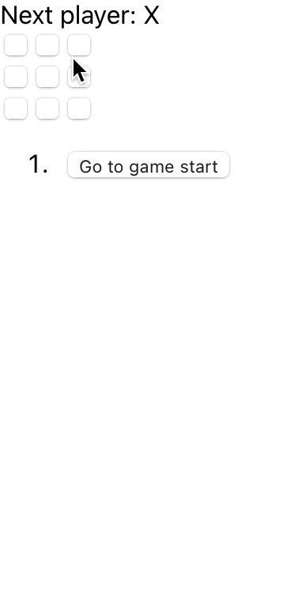

# Using React.js in Tic Tac Toe

## Emmanuel David ||| Z23619905

This Tic Tac Toe game is an introductory react project. It required foundational React concepts like elements, prope, states, and components. This app really showcases a few nice features like:

* Indicating which player won
* Storing each player move as the game moves on
* Allows the player to look at previous moves or versions during the game.
